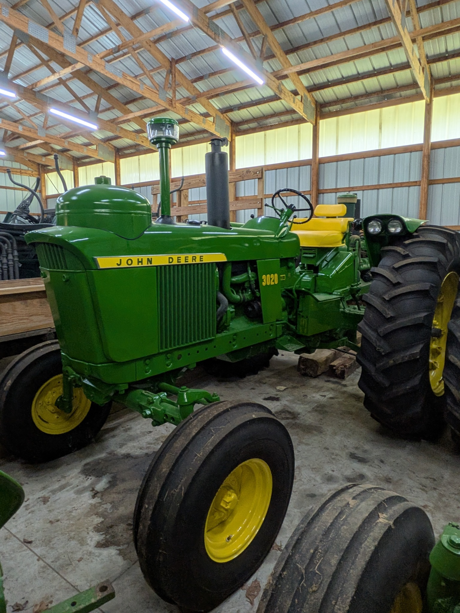

# John Deere Tractor Collection

Photographed July 11, 2026. The collection contains 15 distinct tractors in 15 photographs, arranged approximately from oldest to newest by model introduction. Serial numbers, exact model years, hours, running condition, drivetrain operation, hydraulics, brakes, electrical systems, fluid condition, and tire age remain to be verified before sale.

Click any tractor photo to open the full-resolution image.

## 1. John Deere 720 Gasoline — Wide Front and Power Steering

- **Approximate year:** 1956–1958.
- **Configuration:** Late two-cylinder row-crop tractor with the large horizontal gasoline engine, wide front axle, power steering, and open operator station. The visible ignition and fuel-system hardware identifies this tractor as gasoline-powered.
- **Condition:** Restored or repainted collector-quality exterior with glossy paint, straight sheet metal, clean wheels, and strong tire tread. Minor surface rust remains on the exhaust manifold, with no major exterior damage visible.

## 2. John Deere 820/830-Series Two-Cylinder Diesel Project

- **Approximate year:** 1956–1960.
- **Configuration:** Large standard-tread two-cylinder diesel from the John Deere 820/830 family with an open operator station. The serial tag will distinguish the exact model and production year.
- **Condition:** Indoor-stored restoration or repair project with the hood and side sheet metal removed and the horizontal two-cylinder engine exposed. The main chassis, engine, steering, seat, air cleaner, exhaust system, and rear wheels are present; the exhaust and manifold carry heavy surface rust, and all loose or removed parts should be inventoried.

## 3. John Deere 3010 Diesel

- **Approximate year:** 1960–1963.
- **Configuration:** First-generation New Generation row-crop tractor with a four-cylinder diesel engine, open operator station, and wide front axle.
- **Condition:** Substantially complete and stored indoors, with straight sheet metal and usable tread on the rear tire. The paint is faded, the exhaust components show surface rust, and the tractor carries normal cosmetic wear from age and storage.

## 4. John Deere 3010 Gasoline

- **Approximate year:** 1960–1963.
- **Configuration:** Four-cylinder gasoline New Generation row-crop tractor with an open operator station. The carburetor and spark-ignition engine hardware are visible through the side opening.
- **Condition:** Complete but cosmetically aged, with faded paint, surface rust on the exhaust, a heavily worn seat, and dirt on the wheels and tires. The sheet metal remains generally straight and the rear tire retains substantial tread.

## 5. John Deere 4010 Diesel — Canopy

- **Approximate year:** 1960–1963.
- **Configuration:** Large first-generation New Generation row-crop tractor with a six-cylinder diesel engine, open station, wide front axle, and canopy. Rated output was approximately 84 PTO horsepower.
- **Condition:** Clean older restoration or repaint with straight sheet metal, bright decals, intact operator seating, and a complete canopy. The exhaust system has surface rust, while the visible tires retain agricultural tread.

## 6. John Deere 4020 Diesel — Tractor No. 1

- **Approximate year:** 1963–1972.
- **Configuration:** Six-cylinder diesel New Generation row-crop tractor with an open operator station, wide front axle, and approximately 96 PTO horsepower.
- **Condition:** Indoor-stored and substantially complete, with straight major sheet metal, clean paint, bright decals, and substantial rear-tire tread. The seat and operator area are intact, and minor oil staining is visible on the floor beneath the tractor.

## 7. John Deere 4020 Diesel — Tractor No. 2

- **Approximate year:** 1963–1972.
- **Configuration:** Separate six-cylinder diesel 4020 with an open operator station and wide front axle. The side panel identifies the tractor as a 4020 Diesel.
- **Condition:** Indoor-stored and substantially complete, with generally straight sheet metal and usable agricultural tread. The paint is faded, the front weight bracket and exhaust components show surface rust, and the seat and operator area show age-related wear.

## 8. John Deere 3020 — Open Station

- **Approximate year:** 1964–1972.
- **Configuration:** Mid-sized New Generation row-crop tractor with an open operator station and wide front axle. The photograph does not expose enough engine hardware to confirm the fuel type.
- **Condition:** Clean restoration or repaint with glossy paint, straight panels, bright decals, an intact seat, and good visible tire tread. No major exterior damage is visible.

## 9. John Deere 2020 — Hood-Removed Repair Project

- **Approximate year:** 1965–1971.
- **Configuration:** Four-cylinder John Deere 2020 with a wide front axle, open operator station, and canopy. The hood and side panels have been removed, leaving the engine, radiator, wiring, and accessory drive exposed for repair or restoration work.
- **Condition:** Indoor-stored project tractor with the main chassis, drivetrain, steering, seat, canopy, front grille shell, rear wheels, and major engine components present. The exposed engine compartment shows grime and surface corrosion, and the removed sheet metal and mechanical parts should be inventoried before sale.

## 10. John Deere 2510 Gasoline

- **Approximate year:** 1965–1968.
- **Configuration:** Lighter New Generation row-crop tractor using a four-cylinder gasoline engine and a modified 3020-style chassis. The distributor and spark-ignition hardware are visible on the engine.
- **Condition:** Clean older restoration or repaint with straight sheet metal, bright decals, a clean engine compartment, and an intact operator station. The finish shows only light wear and dust.

## 11. John Deere 5020 Diesel — Enclosed Cab

- **Approximate year:** 1965–1972.
- **Configuration:** Large two-wheel-drive New Generation tractor with an 8.7-liter six-cylinder diesel, period enclosed cab, and approximately 140 PTO horsepower.
- **Condition:** Indoor-stored and substantially complete. The cab glass and exterior sheet metal are intact, the paint has moderate fading and dust, the exhaust components carry surface rust, and the rear tire retains substantial tread.

## 12. John Deere 5020 Diesel — Open Station

- **Approximate year:** 1965–1972.
- **Configuration:** Second 5020 in the collection, equipped with the 8.7-liter six-cylinder diesel and an open operator station rather than an enclosed cab.
- **Condition:** Clean older restoration or repaint with straight sheet metal, bright decals, a complete operator station, and substantial rear-tire tread. Oil staining is visible on the floor beneath the tractor and should be traced before representing the machine as leak-free.

## 13. John Deere 6030 Diesel — Enclosed Cab and Dual Rear Wheels

- **Approximate year:** 1972–1977.
- **Configuration:** Deere's largest conventional New Generation row-crop tractor, normally equipped with a turbocharged 8.7-liter six-cylinder diesel and rated near 175 PTO horsepower. This tractor has an enclosed cab and dual rear wheels.
- **Condition:** Indoor-stored and externally complete, with intact cab glass and straight major panels. The paint is faded, the exhaust system has moderate surface rust, and the visible rear tires retain deep agricultural tread.

## 14. John Deere 7520 Diesel — Articulated Four-Wheel Drive

- **Approximate year:** 1972–1975.
- **Configuration:** Large articulated four-wheel-drive tractor with an 8.7-liter six-cylinder diesel, enclosed cab, and approximately 175 PTO horsepower.
- **Condition:** Indoor-stored and externally complete. The cab glass is intact, the paint shows age and fading, the exhaust components carry surface rust, and the large tires retain substantial lug depth.

## 15. John Deere 4230 — Enclosed Cab

- **Approximate year:** 1973–1977.
- **Configuration:** Generation II row-crop tractor with an enclosed cab. The photograph does not expose enough fuel-system hardware to confirm whether this tractor has the diesel or gasoline engine.
- **Condition:** Externally complete with intact cab glass, straight hood panels, and complete steps and battery box. The paint is faded, the exhaust stack has substantial surface rust, and the visible front tire shows age and tread wear.

## Sale Documentation Still Needed

For each tractor, photograph the serial-number plate, hour meter, engine compartment, operator platform, rear hitch and PTO, tires, and any included loose parts. Record whether the engine starts, whether the tractor moves through all gears, and whether the PTO, hydraulics, steering, brakes, lights, gauges, and charging system operate.
