# John Deere Tractor Collection

Photographed July 11, 2026. This collection contains 15 distinct tractors, arranged approximately from oldest to newest by model introduction.

A family friend reports that the tractors were recently started and running. Model years and configurations are based on visible features and family information; serial numbers, hours, transmission operation, hydraulics, PTO, brakes, steering, electrical systems, fluid condition, and tire age should be verified before sale.

Click any tractor photo to open the full-resolution image.

## 1. John Deere 720 Gasoline — Wide Front and Power Steering

<a href="photos/01-john-deere-720-gasoline.jpg">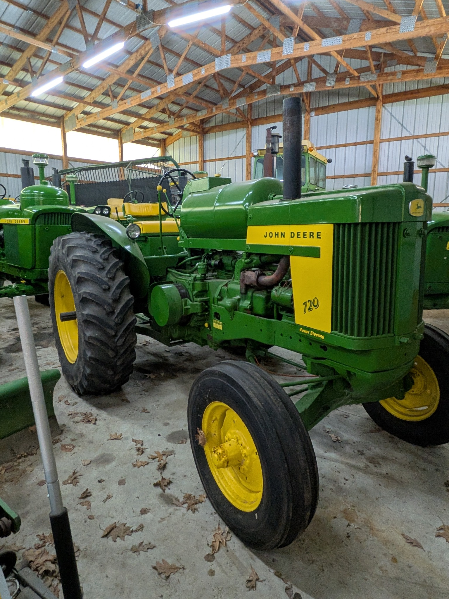</a>

- **Approximate year:** 1956–1958.
- **Configuration:** Late two-cylinder row-crop tractor with a gasoline engine, wide front axle, open operator station, and power steering. The hood carries the original-style **Power Steering** marking.
- **Visible condition:** Clean older repaint with glossy sheet metal, bright lettering, and a complete operator area. The exhaust manifold shows surface rust, and the visible tires retain substantial tread.

## 2. John Deere 820/830-Series Two-Cylinder Diesel Project

<a href="photos/02-john-deere-820-830-series-diesel-project.jpg">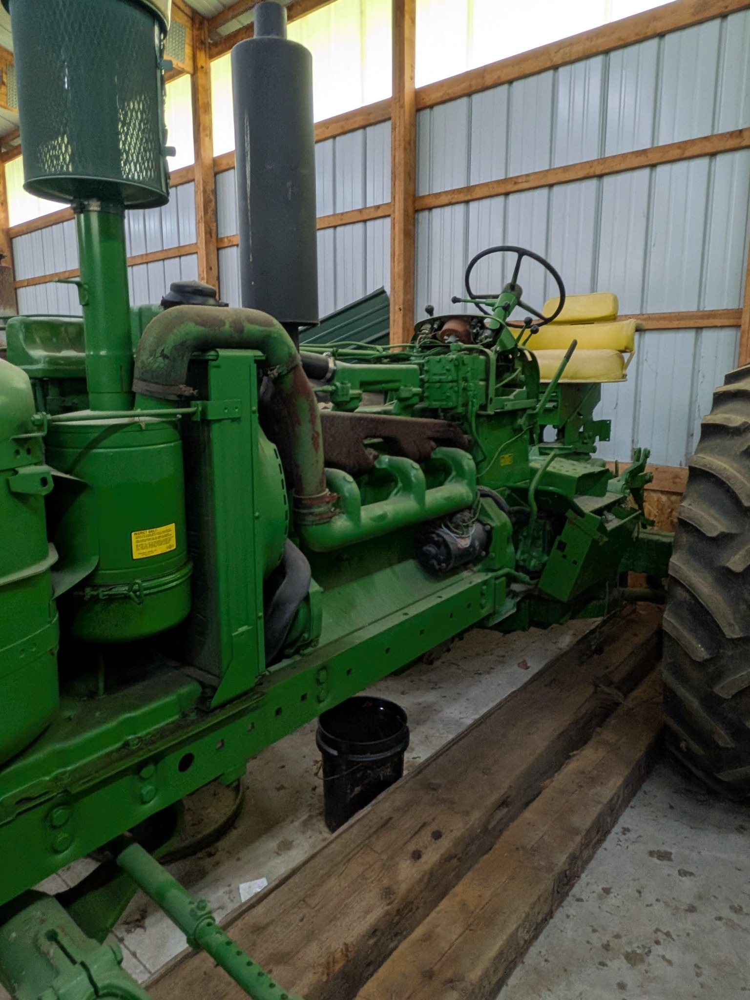</a>

- **Approximate year:** 1956–1960.
- **Configuration:** Large two-cylinder diesel from the John Deere 820/830 family with an open operator station. The serial-number plate will distinguish the exact model and production year.
- **Visible condition:** Indoor-stored repair or restoration project with the hood and side sheet metal removed. The engine, chassis, steering, operator station, air cleaner, exhaust system, and rear wheels are present; the exposed exhaust and manifold carry heavy surface rust, and the removed parts should be inventoried before sale.

## 3. John Deere 3010 Diesel — Wide Front

<a href="photos/03-john-deere-3010-diesel.jpg">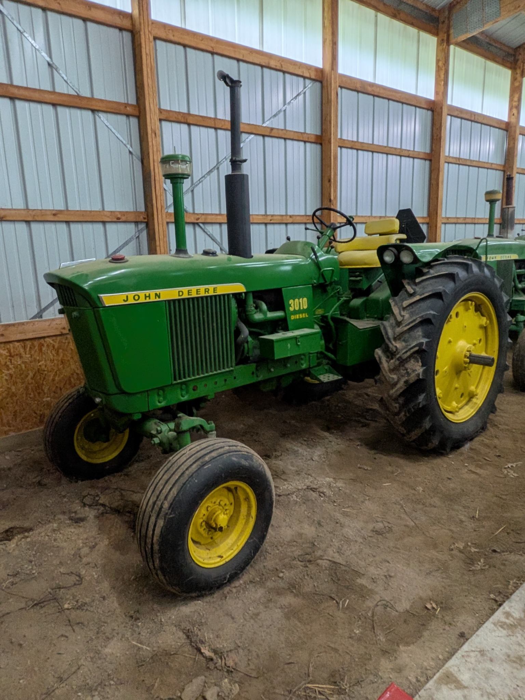</a>

- **Approximate year:** 1960–1963.
- **Configuration:** First-generation New Generation row-crop tractor with a four-cylinder diesel engine, wide front axle, and open operator station.
- **Visible condition:** Complete indoor-stored tractor with generally straight sheet metal and remaining agricultural tread. The paint is faded, the exhaust components show surface rust, and the tractor carries normal cosmetic wear from age and storage.

## 4. John Deere 3010 Gasoline — Wide Front

<a href="photos/04-john-deere-3010-gasoline.jpg">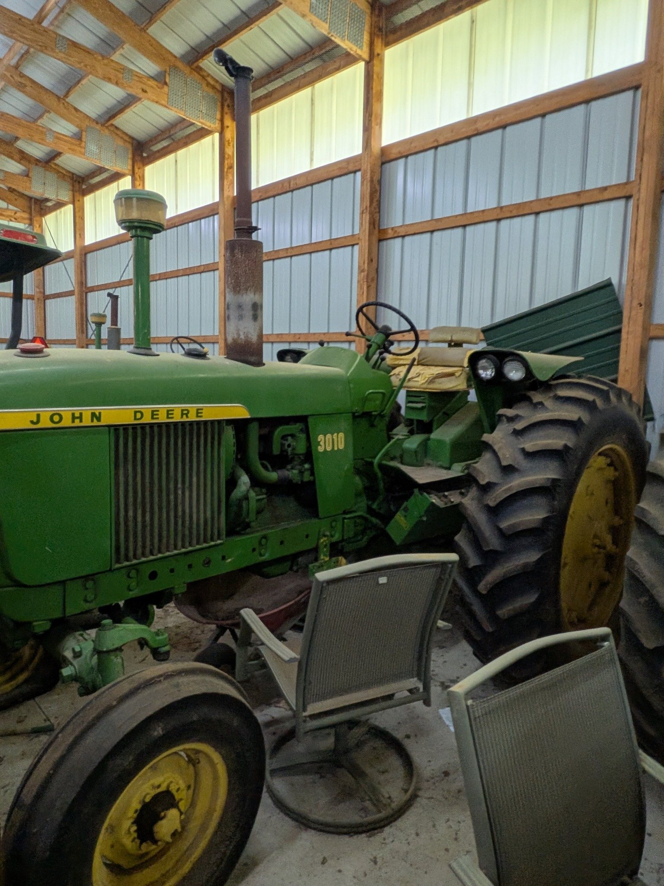</a>

- **Approximate year:** 1960–1963.
- **Configuration:** Four-cylinder gasoline New Generation row-crop tractor with a wide front axle and open operator station. The spark-ignition engine hardware is visible through the side opening.
- **Visible condition:** Complete but cosmetically aged, with faded paint, surface rust on the exhaust, a heavily worn seat, and dirt on the wheels and tires. The major sheet metal remains generally straight, and the rear tire retains substantial tread.

## 5. John Deere 4010 Diesel — Wide Front and Canopy

<a href="photos/05-john-deere-4010-diesel.jpg">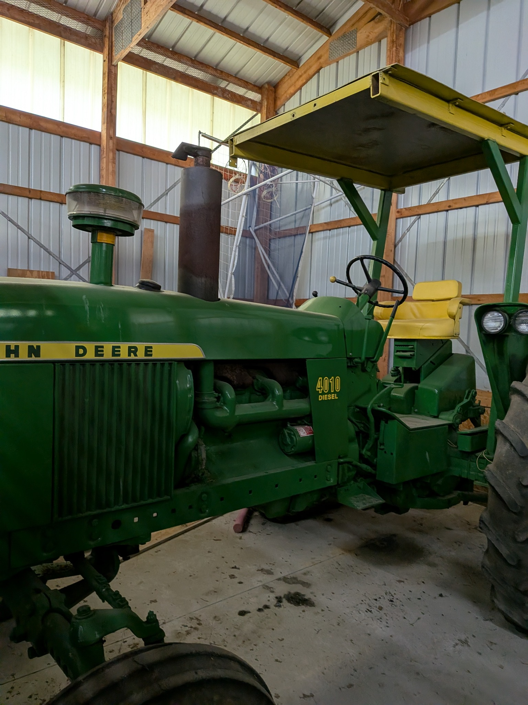</a>

- **Approximate year:** 1960–1963.
- **Configuration:** Large first-generation New Generation row-crop tractor with a six-cylinder diesel engine, wide front axle, open operator station, and canopy.
- **Visible condition:** Clean older repaint with straight major sheet metal, bright decals, intact seating, and a complete canopy. The exhaust system has surface rust, and the visible tires retain agricultural tread.

## 6. John Deere 4020 Diesel Power Shift — Wide Front

<a href="photos/06-john-deere-4020-diesel-power-shift.jpg">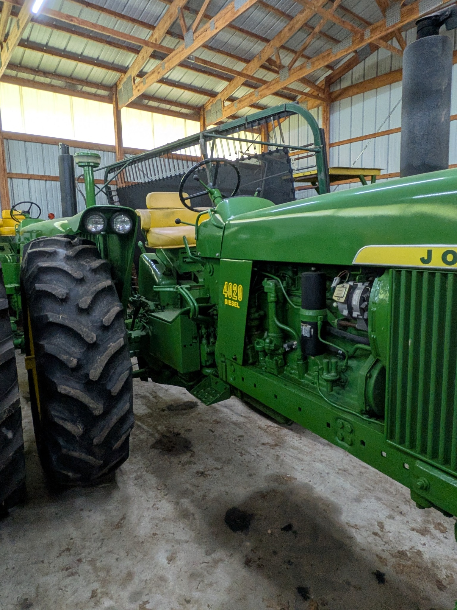</a>

- **Approximate year:** 1964–1968.
- **Configuration:** Early-style six-cylinder diesel 4020 with a factory Power Shift transmission, wide front axle, and open operator station. The Power Shift transmission is an important factory configuration that permits shifting through its operating speeds under load.
- **Visible condition:** Complete indoor-stored tractor with straight major sheet metal, clean paint, bright decals, and substantial rear-tire tread. The seat and operator area are intact, with ordinary age-related wear visible.

## 7. John Deere 4020 Diesel — Tractor No. 2

<a href="photos/07-john-deere-4020-diesel-tractor-2.jpg">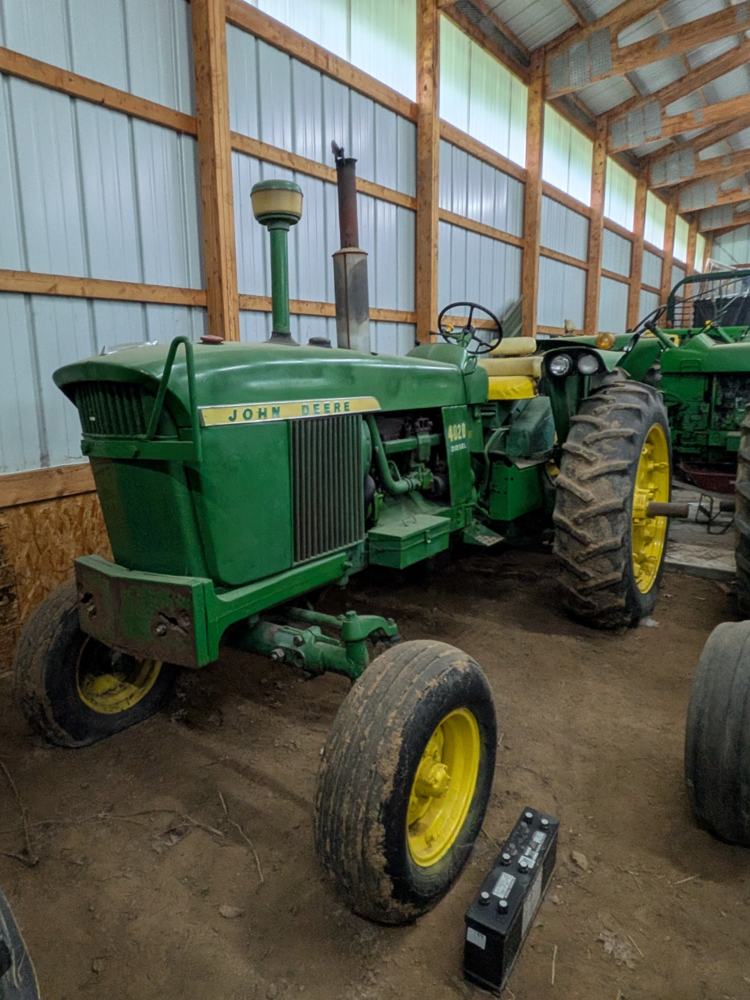</a>

- **Approximate year:** 1964–1968.
- **Configuration:** Separate early-style six-cylinder diesel 4020 with a wide front axle and open operator station. The transmission type remains to be confirmed from the serial plate or shift quadrant.
- **Visible condition:** Complete indoor-stored tractor with generally straight sheet metal and remaining agricultural tread. The paint is faded, the front weight bracket and exhaust components show surface rust, and the seat and operator area show age-related wear.

## 8. John Deere 3020 LP-Gas (Propane) — Wide Front

- **Approximate year:** 1964–1968.
- **Configuration:** Early-style 3020 row-crop tractor with a factory LP-gas/propane engine, wide front axle, and open operator station. The large horizontal pressure tank above the hood identifies the LP-gas configuration.
- **Visible condition:** Clean older repaint with glossy sheet metal, bright decals, an intact seat, and good visible agricultural tread. The tractor is externally complete, with no major sheet-metal damage visible.

## 9. John Deere 2020 — Hood-Removed Repair Project

<a href="photos/09-john-deere-2020-project.jpg">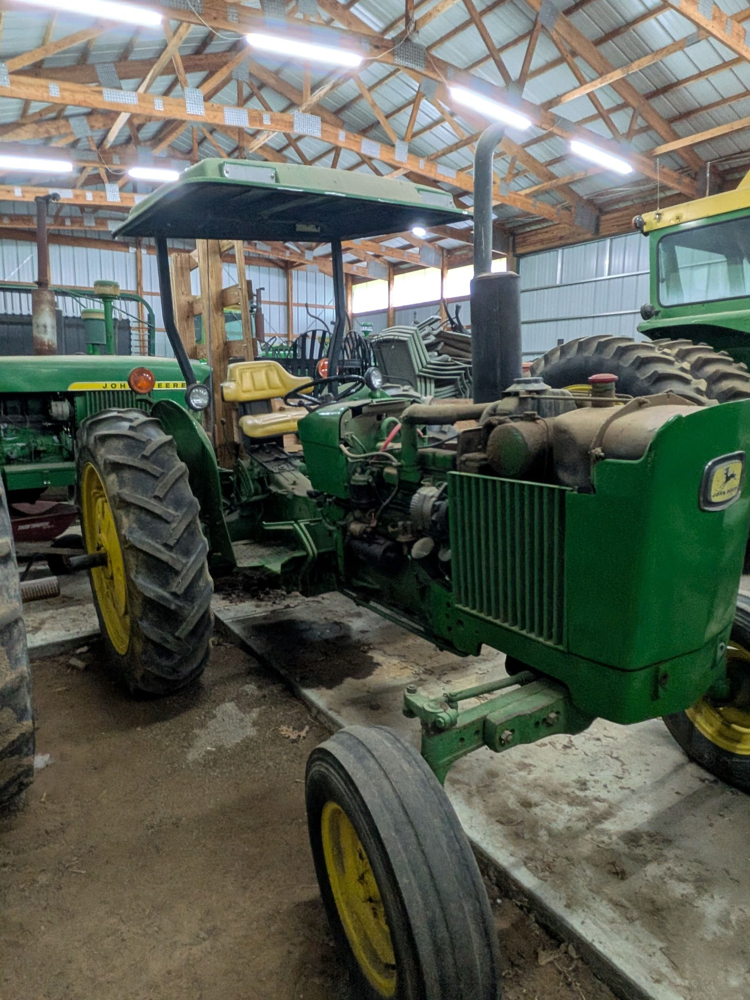</a>

- **Approximate year:** 1965–1971.
- **Configuration:** Four-cylinder John Deere 2020 with a wide front axle, open operator station, and canopy. The hood and side panels have been removed, leaving the engine, radiator, wiring, and accessory drive exposed.
- **Visible condition:** Indoor-stored repair project with the main chassis, drivetrain, steering, seat, canopy, grille shell, rear wheels, and major engine components present. The exposed engine compartment shows grime and surface corrosion, and the removed sheet metal and mechanical parts should be inventoried before sale.

## 10. John Deere 2510 Gasoline — Wide Front

<a href="photos/10-john-deere-2510-gasoline.jpg">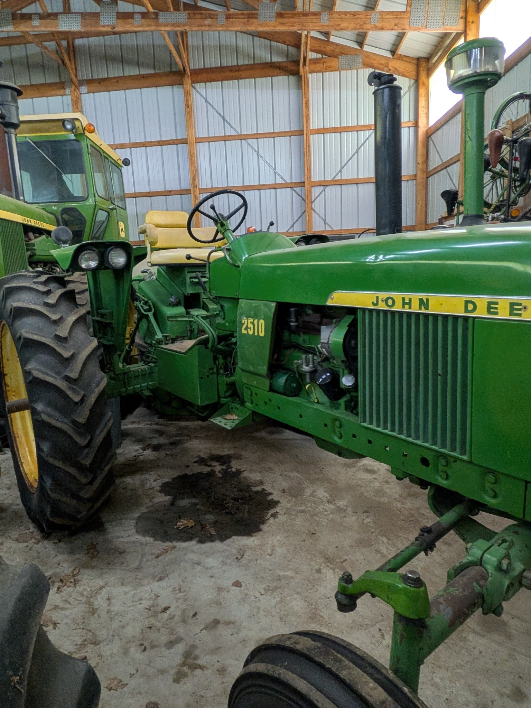</a>

- **Approximate year:** 1965–1968.
- **Configuration:** Lightweight New Generation row-crop tractor with a four-cylinder gasoline engine, wide front axle, and open operator station. The distributor and spark-ignition hardware are visible on the engine.
- **Visible condition:** Clean older repaint with straight sheet metal, bright decals, a clean engine compartment, and an intact operator station. The finish shows light wear and dust consistent with indoor storage.

## 11. John Deere 5020 Diesel — Narrow-Front Row-Crop with Period Cab

<a href="photos/11-john-deere-5020-diesel-cab.jpg">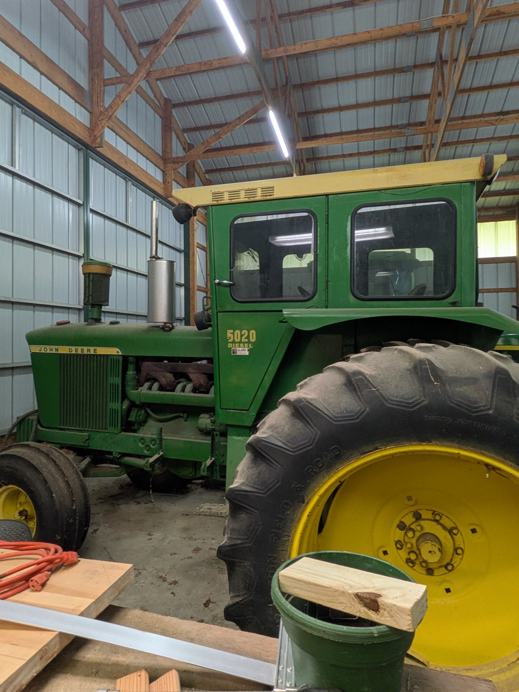</a>

- **Approximate year:** 1966–1972.
- **Configuration:** Large six-cylinder diesel 5020 in the narrow-front row-crop configuration, fitted with a period enclosed cab.
- **Visible condition:** Complete indoor-stored tractor with intact cab glass and generally straight exterior sheet metal. The paint has moderate fading and dust, the exhaust components carry surface rust, and the rear tire retains substantial tread.

## 12. John Deere 5020 Diesel — Open Station

<a href="photos/12-john-deere-5020-diesel-open-station.jpg">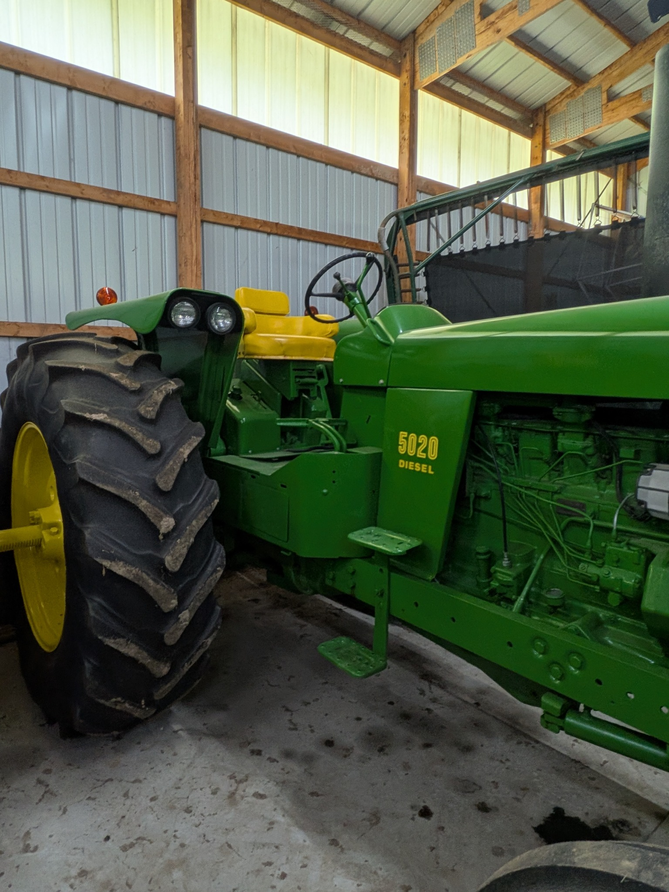</a>

- **Approximate year:** 1965–1972.
- **Configuration:** Second 5020 in the collection, equipped with the large six-cylinder diesel engine and an open operator station rather than an enclosed cab. The front-axle configuration is outside the photograph and remains to be documented.
- **Visible condition:** Clean older repaint with straight sheet metal, bright decals, a complete operator station, and substantial rear-tire tread. Mechanical condition and any fluid seepage should be checked in person.

## 13. John Deere 6030 Diesel — Cab, Duals, and Front Weights

<a href="photos/13-john-deere-6030-diesel.jpg">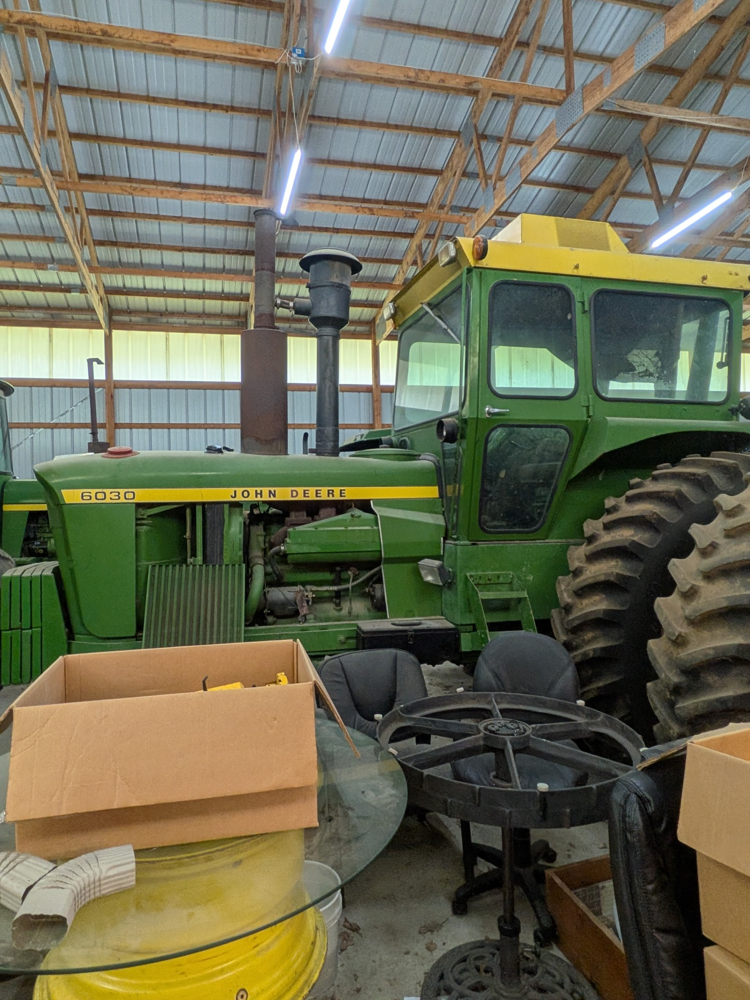</a>

- **Approximate year:** 1972–1977.
- **Configuration:** Large conventional row-crop tractor with a turbocharged six-cylinder diesel, eight-speed transmission, enclosed cab, dual rear wheels, and a substantial stack of front suitcase weights.
- **Visible condition:** Indoor-stored and externally complete, with intact cab glass and straight major panels. The paint is faded, the exhaust system has moderate surface rust, and the visible rear tires retain deep agricultural tread.

## 14. John Deere 7520 Diesel — Articulated Four-Wheel Drive

<a href="photos/14-john-deere-7520-diesel.jpg">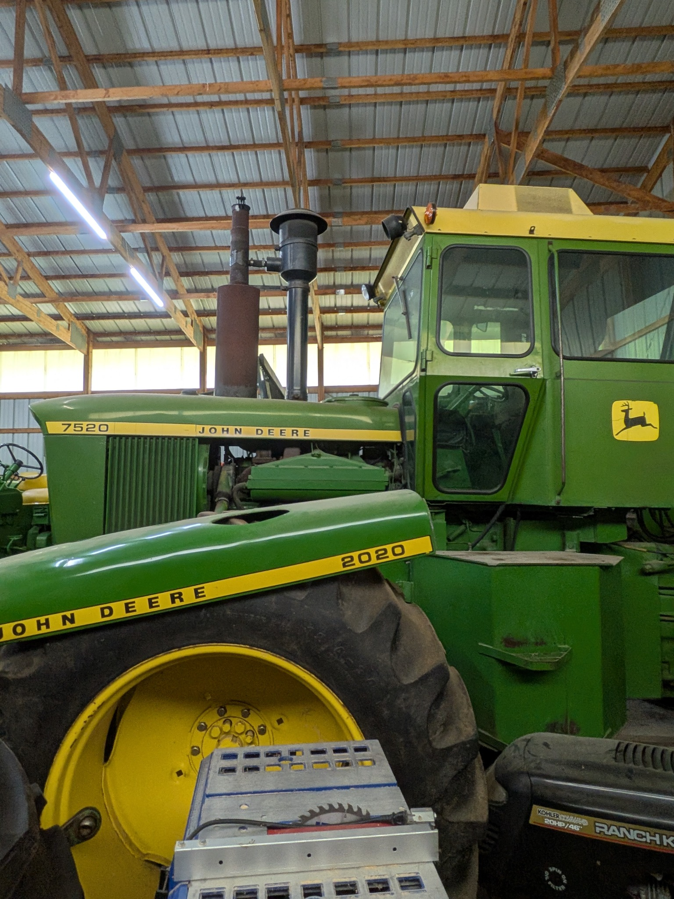</a>

- **Approximate year:** 1972–1975.
- **Configuration:** Large articulated four-wheel-drive tractor with a turbocharged and intercooled six-cylinder diesel, 16-speed transmission, enclosed cab, and dual wheels.
- **Visible condition:** Indoor-stored and externally complete. The cab glass is intact, the paint shows age and fading, the exhaust components carry surface rust, and the large tires retain substantial lug depth.

## 15. John Deere 4230 — Sound-Gard Body

<a href="photos/15-john-deere-4230-cab.jpg">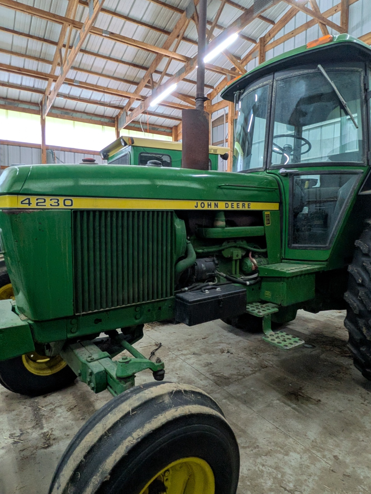</a>

- **Approximate year:** 1973–1977.
- **Configuration:** Generation II two-wheel-drive row-crop tractor with a wide front axle and Deere Sound-Gard Body. The engine fuel type and transmission configuration remain to be confirmed from the serial plate and controls.
- **Visible condition:** Externally complete with intact cab glass, straight hood panels, and complete steps and battery box. The paint is faded, the exhaust stack has substantial surface rust, and the visible front tire shows age and tread wear.

## Sale Documentation Still Needed

For each tractor, photograph the serial-number plate, hour meter, engine compartment, operator platform, rear hitch and PTO, tires, and any included loose parts. Record whether the engine starts, whether the tractor moves through all gears, and whether the PTO, hydraulics, steering, brakes, lights, gauges, and charging system operate.
